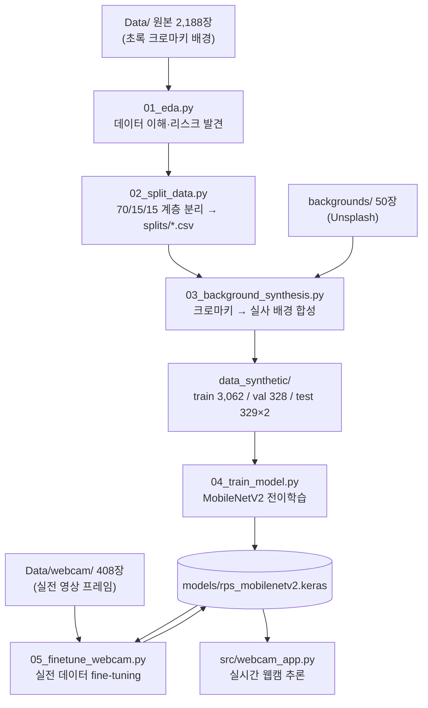
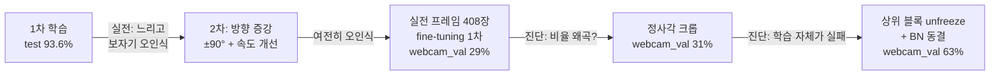

# RPS 손 제스처 인식 — 아키텍처 & 코드 해설

> 이 문서는 프로젝트가 **어떤 구조로, 왜 이렇게** 만들어졌는지를 처음부터 끝까지 설명한다.
> 코드를 직접 읽기 전의 지도이자, 각 시행착오에서 무엇을 배웠는지의 기록이다.
>
> ⚠️ **이후 갱신 안내**: 이 문서 작성 시점 이후 학습 프레임워크가 **Keras/TensorFlow →
> PyTorch**로 전면 교체되었고, MediaPipe 손 검출·wandb 실험 추적·실시간 즉석학습 등이
> 추가되었다. 아래 §1~6(배경 합성까지)의 이야기와 데이터 리크·배경 편향 같은 문제의
> 뿌리는 여전히 유효하지만, **코드 예시(Keras API)는 더 이상 실제 코드와 다르다.**
> 지금 시점의 폴더·파일·라이브러리별 정확한 역할은 [TECHNICAL_REFERENCE.md](TECHNICAL_REFERENCE.md)를 참고할 것.

---

## 1. 한눈에 보는 전체 구조



핵심 규칙 하나가 이 구조 전체를 지배한다:

> **학습(스크립트)과 추론(앱)은 서로를 직접 호출하지 않는다. 오직 저장된 모델 파일로만 연결된다.**

이렇게 하면 학습 환경(무거운 파이프라인, 데이터셋)과 실행 환경(웹캠 앱)이 완전히 분리되고,
모델을 갈아끼우는 것이 "파일 교체" 한 번이 된다. 실제로 이 프로젝트에서 모델을 4번
재학습했지만 앱 코드는 전처리 규격 외엔 손대지 않았다.

---

## 2. 설계 원칙 세 가지

### 원칙 1 — split을 먼저 확정하고, 가공은 그 안에서만

`02_split_data.py`가 만드는 `splits/*.csv`가 이 프로젝트의 "헌법"이다. 배경 합성(03)도,
학습(04)도 전부 이 파일 목록만 참조한다.

왜 이 순서가 중요한가? 만약 2,188장 전체를 먼저 배경 합성해서 4,000여 장으로 불린 뒤
train/test를 나누면, **같은 손 사진의 배경만 다른 버전**이 train과 test에 각각 흘러 들어간다.
모델은 "그 손"을 이미 봤으므로 test 점수가 부풀려진다. 이것이 **데이터 리크(data leak)** 이고,
"test 95%인데 실전에서 형편없는" 모델의 단골 원인이다.

같은 원칙이 5단계 웹캠 데이터에서 한 번 더 등장한다(§3.5의 시간순 분할).

### 원칙 2 — 전처리 규격은 학습과 추론이 자동으로 일치해야 한다

전처리가 학습 따로 추론 따로 구현되어 있으면 언젠가 반드시 어긋난다. 이 프로젝트의 대응:

- 픽셀 정규화: 파이프라인은 `/255.0`(0~1)까지만 하고, MobileNetV2가 요구하는 −1~1 변환은
  **모델 내부의 `Rescaling(2.0, offset=-1.0)` 레이어**가 담당한다. 모델 파일 안에 규격이
  내장되므로 앱 쪽에서 실수할 여지가 없다.
- 증강(RandomFlip 등)도 모델 내부 레이어다. Keras의 증강 레이어는 **학습 시에만 동작**하고
  추론 시엔 자동으로 통과(no-op)라서, 앱이 증강을 신경 쓸 필요가 없다.

### 원칙 3 — 평가는 "실전을 예측하는 지표"를 향해 계속 이동

프로젝트 내내 평가 지표가 3번 진화했고, 매번 "더 실전에 가까운 것"으로 옮겨갔다:

| 시점 | 지표 | 한계 |
|---|---|---|
| 초기 | test_original (초록 배경) | 실전과 무관한 배경 |
| 배경 합성 후 | test_synthetic (실사 배경) | 손 모양·각도가 여전히 원본 데이터셋 스타일 |
| 웹캠 데이터 후 | **webcam_val (실전 프레임)** | 현재의 최종 지표. 조기종료·모델 선택 기준도 이것 |

"무엇을 최적화할 것인가"를 정하는 일이 모델 구조보다 중요했다 — 뒤의 시행착오 연대기(§4)에서
test 94% 모델이 실전 29%였던 사건이 이를 증명한다.

---

## 3. 단계별 코드 리뷰

### 3.1 `01_eda.py` — 데이터를 의심하는 단계

하는 일: 클래스 분포, 이미지 규격/손상 검사, 밝기 분포, **RGB 채널 평균 비교**.

가장 중요한 산출물은 마지막 것이다:

```
[rock]     R=79.1  G=140.9  B=65.3
[paper]    R=88.9  G=140.1  B=68.6
[scissors] R=78.1  G=139.7  B=62.2
```

세 클래스 모두 G(초록)가 압도적이다. 전 이미지가 초록 크로마키 배경이기 때문인데, 이는
**모델이 손 모양이 아니라 배경색 통계로 답을 맞힐 수 있다**는 뜻이다. 이 리스크 하나가
3단계(배경 합성)의 존재 이유가 됐다. EDA는 "그림 그려보는 요식 행위"가 아니라
이후 파이프라인의 설계 근거를 만드는 단계다.

### 3.2 `02_split_data.py` — 2단계 stratified 분리

```python
tr, tmp = train_test_split(..., test_size=0.30, stratify=labels)   # 70 : 30
va, te  = train_test_split(tmp, test_size=0.50, stratify=tmp_y)    # 15 : 15
```

- `stratify`: 클래스 비율(726/712/750)을 세 세트에 동일하게 유지. 이게 없으면 우연히
  한 세트에 특정 클래스가 몰려 평가가 왜곡될 수 있다.
- 결과를 메모리에 들고 다니지 않고 **CSV로 박제**한다. 이후 어떤 스크립트를 몇 번
  재실행해도 분리는 불변 — 원칙 1의 구현이다. `random_state=42` 고정도 같은 목적.

### 3.3 `03_background_synthesis.py` — 크로마키 합성

절차는 고전적인 그린스크린 제거다:

```python
hsv  = cv2.cvtColor(img, cv2.COLOR_BGR2HSV)
mask = cv2.inRange(hsv, [35, 60, 60], [85, 255, 255])   # 초록 = 배경
mask = cv2.morphologyEx(mask, cv2.MORPH_OPEN,  k)  # 손 안의 오검출 점 제거
mask = cv2.morphologyEx(mask, cv2.MORPH_CLOSE, k)  # 배경의 작은 구멍 메움
```

- **왜 HSV인가**: RGB에서 "초록"은 조명에 따라 값이 크게 변하지만, HSV에서는 색상(H)이
  35~85 범위로 안정적으로 잡힌다. 채도·명도 하한(60)을 둬서 어두운 그림자나 회색이
  초록으로 오인되는 것을 막는다. 이 임계값은 샘플을 시각화해가며 튜닝한 값이다.
- **소프트 블렌딩**: 마스크를 0/1로 바로 쓰면 손 경계가 톱니처럼 잘린다. 마스크에
  가우시안 블러를 걸어 0~1 알파로 만들고 `손×α + 배경×(1−α)`로 섞으면 경계가 자연스럽다.
- **세트별 합성 정책**(원칙 1): train은 이미지당 배경 2개(다양성), val은 1개(train과 동일
  분포로 조기종료 판단의 신뢰성 확보), test는 원본과 합성 **두 벌 유지** — 이 두 벌의
  정확도 차이가 곧 "배경 증강의 효과"를 정량화한다.

트러블슈팅 — Windows 한글 경로: `cv2.imread`는 경로에 한글(`개인`)이 있으면 조용히
`None`을 반환한다. 우회는 파일 IO와 디코딩을 분리하는 것:

```python
def imread_u(path):
    data = np.fromfile(str(path), dtype=np.uint8)  # 파이썬이 파일을 읽고
    return cv2.imdecode(data, cv2.IMREAD_COLOR)    # cv2는 바이트만 디코딩
```

### 3.4 `04_train_model.py` — MobileNetV2 전이학습

#### 왜 전이학습인가

3,000여 장으로 CNN을 밑바닥부터 학습하기엔 데이터가 부족하다. ImageNet 130만 장으로
학습된 MobileNetV2는 이미 "가장자리 → 질감 → 부위 형태" 같은 시각 특징 추출기를 갖고 있다.
이걸 **동결(frozen)** 해서 특징 추출기로 쓰고, 그 위에 얇은 분류 head만 새로 학습한다.
MobileNetV2를 고른 이유는 실시간 웹캠 추론(CPU)을 버텨야 하기 때문 — 정확도 대비
연산량이 가장 가벼운 축이다.

#### 모델 구조와 각 층의 존재 이유

```python
inputs = keras.Input((224, 224, 3))
x = augment(inputs)                        # 증강 (학습 시에만 동작)
x = keras.ops.clip(x, 0.0, 1.0)            # 증강 후 0~1 범위 보장
x = layers.Rescaling(2.0, offset=-1.0)(x)  # 0~1 → −1~1 (MobileNetV2 규격)
x = base(x, training=False)                # 동결된 MobileNetV2
x = layers.GlobalAveragePooling2D()(x)     # 7×7×1280 → 1280 벡터
x = layers.Dropout(0.3)(x)
x = layers.Dense(128, activation="relu")(x)
x = layers.Dropout(0.3)(x)
outputs = layers.Dense(3, activation="softmax")(x)
```

- `clip`: `RandomBrightness`가 픽셀을 0~1 밖으로 밀어낼 수 있어서 안전벨트로 넣었다.
  (Keras 3에서는 `tf.clip_by_value`를 함수형 그래프에 직접 못 쓰고 `keras.ops.clip`을
  써야 한다는 것도 여기서 배웠다.)
- `base(x, training=False)`: base 안의 BatchNorm이 항상 "추론 모드"(고정된 이동 통계)로
  동작하게 한다. 전이학습에서 이걸 빼먹으면 BN 통계가 우리의 작은 데이터셋으로 오염된다.
- `GlobalAveragePooling2D`: 7×7 공간 격자를 평균 내서 위치에 둔감한 벡터로 만든다.
  Flatten 대비 파라미터가 없어 과적합에 강하다. (단, "이미지 전체를 평균"하기 때문에
  손이 화면의 일부일 때 신호가 희석된다 — 이 성질이 §4의 실패 원인 중 하나로 재등장한다.)
- Dropout 2개: head가 3천 장 규모에서 외우기 시작하는 것을 막는 정칙화.

#### 학습 제어

```python
EarlyStopping(monitor="val_loss", patience=5, restore_best_weights=True)
ModelCheckpoint(MODEL_PATH, save_best_only=True)
```

- 조기종료: val_loss가 5 epoch 연속 나아지지 않으면 중단하고 **최고 시점 가중치로 복원**.
- 체크포인트: 디스크의 모델 파일도 항상 "최고 시점"만 남는다.
- 이후 fine-tuning 단계에서는 `initial_value_threshold=min(이전 val_loss)`를 추가했다 —
  2단계 학습이 1단계보다 못하면 **모델 파일을 덮어쓰지 않는** 퇴행 방지 장치다.
  실제로 fine-tuning이 발산했을 때 이 장치가 모델을 지켰다.

#### 평가 설계

confusion matrix를 보는 이유는 정확도 한 줄이 숨기는 정보 때문이다. "가위/보 혼동"처럼
**어느 방향으로 틀리는지**가 다음 액션(데이터 보강 대상)을 결정한다. 평가 직전에
`load_model`로 디스크 모델을 다시 읽는 것도 의도적이다 — 메모리에 있는 모델과 저장된
모델이 다를 수 있는 상황(조기종료 복원 vs 체크포인트)에서 "배포될 그 파일"을 평가한다.

### 3.5 `05_finetune_webcam.py` — 실전 데이터 fine-tuning

실전 영상 프레임 408장을 기존 학습에 편입하는 스크립트. 세 가지 결정이 핵심이다.

**① 시간순 70/30 분할.** 프레임 파일명이 `paper_video__f0000.jpg` 연속 프레임이다.
무작위로 나누면 0.03초 간격의 거의 동일한 두 프레임이 train과 val에 하나씩 들어가
val 점수가 가짜로 높아진다(원칙 1의 데이터 리크가 형태만 바꿔 재등장). 그래서
각 클래스에서 **영상 앞 70%는 train, 뒤 30%는 val**로 시간을 잘라 나눈다.
이 분할은 점수를 낮게(=정직하게) 만든다.

**② 중앙 정사각 크롭.** 세로 프레임(360×640)을 224×224로 그냥 리사이즈하면 세로가
가로보다 1.8배 더 눌려 손가락 비례가 붕괴된다. 웹캠 프레임만 중앙 360×360을 잘라
비율을 보존한다. 합성 이미지는 기존 규격(300×200 왜곡 리사이즈)을 유지해야 하므로,
**전처리가 다른 두 데이터셋을 각각 디코딩한 뒤 결합**하는 구조가 됐다:

```python
train_ds = (raw_ds(syn_items, crop=False)
            .concatenate(raw_ds(wc_items, crop=True))
            .shuffle(...).batch(32).prefetch(...))
```

**③ 5배 반복 가중.** 웹캠 train 285장 vs 합성 3,062장 — 그대로 섞으면 웹캠 데이터의
그래디언트 기여가 8%뿐이라 묻힌다. 목록을 5번 반복해 비중을 약 32%로 끌어올렸다.
(에폭마다 셔플되고 증강이 매번 다르게 걸리므로 단순 복제보다 낫다.)

그리고 가장 중요한 변경 — **상위 블록 unfreeze**:

```python
base.trainable = True
for layer in base.layers[:-40]:            # 하위층은 계속 동결
    layer.trainable = False
for layer in base.layers:                  # BatchNorm은 전부 동결
    if isinstance(layer, keras.layers.BatchNormalization):
        layer.trainable = False
model.compile(optimizer=keras.optimizers.Adam(5e-5), ...)
```

왜 head만으로는 안 됐는지, 왜 BN을 따로 동결하는지는 §4의 연대기에서 사건 순서대로 설명한다.

### 3.6 `src/webcam_app.py` — 실시간 추론 앱

프레임 루프는 단순하지만, 각 상수가 UX 문제 하나씩을 해결한다:

| 장치 | 코드 | 해결하는 문제 |
|---|---|---|
| ROI 박스 | `ROI = (140, 60, 500, 420)` 정사각 | 손을 어디에 둘지 사용자에게 알려주고, 배경 비중을 줄이고, 학습 데이터(정사각 크롭)와 규격을 맞춤 |
| 스무딩 | 최근 7프레임 확률 **평균** | 단일 프레임의 흔들리는 예측이 라벨을 깜빡이게 하는 것 방지. argmax 다수결이 아니라 확률 평균인 이유: 신뢰도 정보가 보존되어 아래 임계값과 자연스럽게 결합됨 |
| 임계값 | 평균 최대 확률 < 0.75 → "WAITING" | 손이 없거나 전환 중일 때 아무 클래스나 찍는 것 방지 |
| 쿨다운 | 트리거 후 2초 봉인 | 한 제스처가 수십 프레임 유지되는 동안 액션이 연사되는 것 방지 |
| 액션 매핑 | `on_action(gesture)` 딕셔너리 | 게임 로직/키 입력 등으로 교체하는 지점을 한 함수로 격리 |

성능 트러블슈팅: 처음엔 프레임마다 `model.predict()`를 호출했는데 체감이 크게 느렸다.
`predict()`는 배치 추론용 API라 호출마다 수백 ms급 오버헤드가 있다. 해결:

```python
infer = tf.function(lambda x: model(x, training=False),
                    input_signature=[tf.TensorSpec([1, 224, 224, 3], tf.float32)])
infer(tf.zeros([1, 224, 224, 3]))   # 워밍업 — 첫 호출의 그래프 컴파일을 미리 치름
```

`tf.function`은 파이썬 호출을 컴파일된 그래프 실행으로 바꿔 프레임당 수십 ms로 줄인다.
`input_signature` 고정은 입력 형태가 바뀔 때마다 재컴파일되는 것을 막는다.

---

## 4. 시행착오 연대기 — 실패가 설계를 만든 순서

이 프로젝트에서 가장 가치 있는 부분. 각 실패가 어떤 진단을 거쳐 어떤 설계 변경이 됐는지의 기록이다.



### 사건 1 — "test 93.6%인데 실전에서 형편없다"

배경 합성까지 마친 1차 모델은 test_synthetic 93.6%였지만 실전 웹캠에서 보자기를
가위로 읽었다. 원인은 지표 자체에 있었다: test 셋도 결국 **원본 데이터셋의 손**(가로 방향,
손가락 모음)이라, "실전 손 방향/모양"에 대한 성능은 측정조차 되지 않고 있었다.
→ 교훈: 지표가 실전과 다른 분포면, 지표가 좋을수록 더 위험하다 (원칙 3의 기원).

### 사건 2 — 재학습해도 그대로: 데이터 없이는 못 넘는 갭

방향 증강(±90°)과 ROI 비율 수정으로 2차 학습을 했지만 실전 개선은 미미했다.
증강은 "있는 데이터의 변형"일 뿐, 원본 데이터셋에 아예 없는 특징(손가락을 편 보자기,
복잡한 사무실 배경, 특정 조명)은 만들어내지 못한다. → 실전 프레임 수집으로 전환.

### 사건 3 — fine-tuning 1차: 29%, 찍기보다 못한 점수

실전 프레임을 섞어 fine-tuning한 결과가 webcam_val 29.3%(3클래스 무작위 = 33%).
train 정확도는 오르는데 val_loss는 1 epoch부터 계속 악화 — 전형적 과적합 곡선.
이때 두 가설이 있었다:

- 가설 A: 세로 프레임 뭉개기 리사이즈로 손가락 비례 붕괴 (기하 문제)
- 가설 B: 모델이 웹캠 프레임을 외우기만 하고 일반화 실패 (데이터 다양성 문제)

### 사건 4 — 정사각 크롭: 31%. 가설 A 기각, 그리고 결정적 진단

크롭 후에도 31%. 여기서 추측을 멈추고 진단 스크립트(`diag_webcam.py`)를 만들었다.
핵심 질문: **"모델이 웹캠 train 프레임 자체는 맞히는가?"**

```
wc_train: 54% (paper 26%)   ← 학습 데이터조차 못 맞힘
wc_val:   31% (paper  0%)
```

이 숫자가 프레임을 완전히 바꿨다. train을 못 맞힌다는 것은 과적합(암기)이 아니라
**학습 실패** — 즉 가설 B도 틀렸고, 문제는 모델의 표현 능력이었다. 몽타주 시각화로
확증: 크고 선명한 보자기조차 scissors로 예측하고 있었다.

원인 분석: 원본 데이터셋의 paper는 손가락을 **모은** 손, 사용자의 보자기는 손가락을
**편** 손이다. "벌어진 손가락" 특징은 합성 데이터 세계에서 scissors의 전유물이었다.
동결된 ImageNet 특징 위 얕은 head는 이 충돌을 분리할 용량이 없고, 데이터의 68%인
합성 쪽 그래디언트가 항상 이긴다. head는 웹캠 paper를 포기하는 것이 전체 loss에 유리했다.

→ 방법론 교훈: **train 정확도와 val 정확도를 분리해서 보면 "암기"와 "학습 불능"을
구분할 수 있고, 두 진단의 처방은 정반대다** (암기 → 데이터/정칙화, 학습 불능 → 모델 용량).

### 사건 5 — unfreeze + BatchNorm 동결: 63%

처방은 표현 용량 확대 = 상위 블록 unfreeze. 그런데 이전에 한 번 unfreeze로 발산한
전적이 있었다. 이번엔 통상적 용의자인 **BatchNorm을 전 층 명시 동결**하고 낮은
학습률(5e-5)로 재시도했다. BN이 위험한 이유: `trainable=True`가 되는 순간 BN의
스케일/시프트 파라미터가 작은 배치 통계에 맞춰 요동치며 하위층 전체의 입력 분포를
흔든다. 사전학습 모델 fine-tuning에서 BN 동결은 사실상 표준 수칙이다.

결과: webcam_val 63.4% (paper 0% → 68%), 기존 test는 오히려 상승(97.3%/95.7%).
남은 병목은 scissors(29%)이고, 이는 한 영상에서 나온 연속 프레임의 포즈 다양성 한계 —
모델링이 아니라 **추가 촬영으로 풀 문제**다.

---

## 5. 이 프로젝트에 등장한 개념 미니 사전

| 개념 | 이 프로젝트에서의 의미 |
|---|---|
| 전이학습 | ImageNet으로 배운 시각 특징을 재사용. 데이터 3천 장으로도 학습이 가능한 이유 |
| 도메인 갭 | 학습 분포(초록 배경, 가로 손, 모은 손가락)와 실전 분포(사무실, 세로 손, 편 손가락)의 차이. 이 프로젝트 모든 실패의 공통 뿌리 |
| 데이터 리크 | 사실상 같은 샘플이 train과 평가에 모두 존재해 점수가 부풀려지는 것. 여기선 두 번 등장: 합성 전 분리(§3.2), 연속 프레임 시간순 분할(§3.5) |
| 과적합 vs 학습 실패 | train↑ val↓ = 과적합(암기), train도 낮음 = 용량/표현 부족. 진단이 다르면 처방도 다르다 (§4 사건 4) |
| GlobalAveragePooling | 위치 불변성을 주지만 배경까지 평균해 작은 물체의 신호를 희석 |
| BatchNorm 동결 | fine-tuning 시 BN 통계/파라미터가 작은 데이터에 오염돼 발산하는 것 방지 |
| 조기종료 + 최적 복원 | "가장 오래 학습한 모델"이 아니라 "검증 성능이 가장 좋았던 순간의 모델"을 쓴다 |
| tf.function | 파이썬 오버헤드를 없앤 컴파일 실행. 실시간 추론의 필수 요소 |

---

## 6. 현재 상태와 남은 과제

**성능 (2026-08-19 기준)**

| 지표 | 값 |
|---|---|
| webcam_val (실전 지표) | 63.4% — rock 93% / paper 68% / scissors 29% |
| test_original | 97.3% |
| test_synthetic | 95.7% |

프레임 단위 63%지만 앱에는 7프레임 스무딩 + 0.75 임계값이 있어 체감 인식률은 이보다 높다.

**남은 과제 (효과 순)**

1. 추가 촬영 — 특히 scissors를 다양한 각도·거리로 짧은 영상 여러 개. 현재 병목은
   모델이 아니라 데이터 다양성이다.
2. 영상 단위 분할 — 영상이 여러 개가 되면 "영상 자체"를 train/val로 나눠
   더 정직한 검증이 가능해진다.
3. (선택) 손 검출 도입 — MediaPipe 등으로 손 영역을 자동 크롭하면 ROI 박스 제약과
   배경 희석 문제가 동시에 풀린다. 단, 실시간 성능 예산과 상의할 것.

**파일 맵**

```
scripts/01_eda.py                  데이터 이해 · 배경 편향 발견
scripts/02_split_data.py           분리 확정 (splits/*.csv = 불변 기준)
scripts/03_background_synthesis.py 크로마키 합성 (HSV 마스킹 + 소프트 블렌딩)
scripts/04_train_model.py          전이학습 + 평가 (증강·정규화는 모델 내장)
scripts/05_finetune_webcam.py      실전 fine-tuning (시간순 분할 · 크롭 · unfreeze)
scripts/diag_webcam.py             진단 도구 (train/val 분리 평가 · 타임라인 · 몽타주)
src/webcam_app.py                  실시간 추론 (ROI · 스무딩 · 임계값 · 쿨다운)
models/rps_mobilenetv2.keras       학습↔추론의 유일한 접점
outputs/                           모든 실험의 증거 (그래프 · confusion matrix · 리포트)
```
