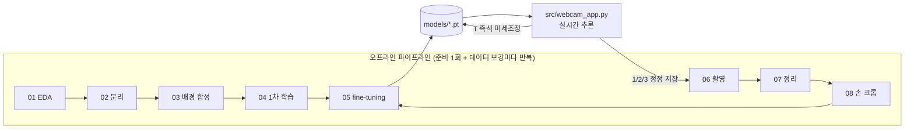
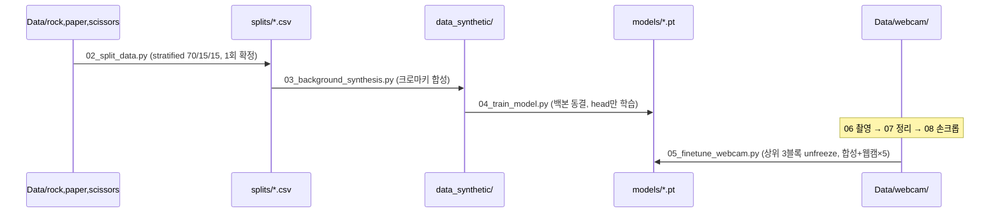
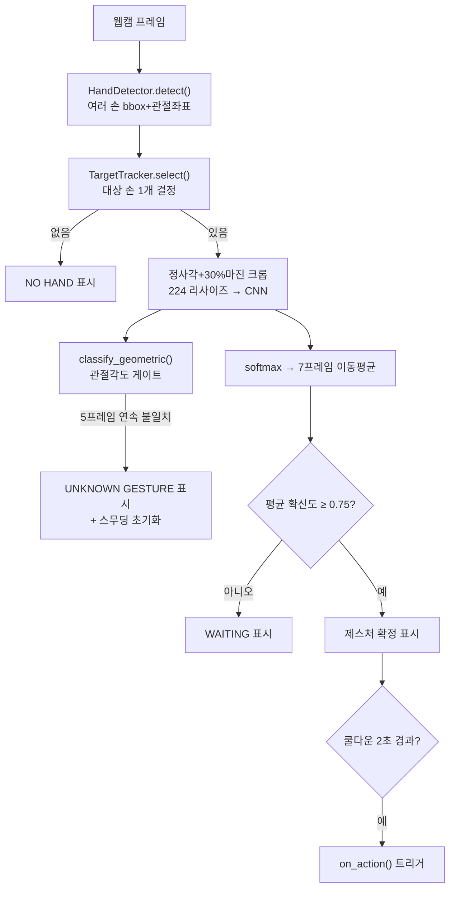
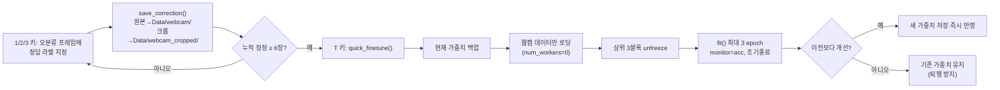

# RPS 프로젝트 기술 문서

> 이 문서는 프로젝트의 **모든 폴더·파일·라이브러리·코드 선택**을 한 곳에서 찾아볼 수 있는
> 레퍼런스다. "왜 이런 흐름으로 진행됐는지"의 이야기는 [ARCHITECTURE.md](ARCHITECTURE.md)에,
> "지금 이 파일이 정확히 뭘 하는지 · 왜 이 라이브러리인지"는 이 문서에 정리한다.
> 기준 시점: 2026-08-19, 커밋 `6d9a84a`.

---

## 0. 프로젝트 한 줄 요약

웹캠으로 가위/바위/보 손 모양을 실시간 인식해 액션을 트리거하는 시스템.
**PyTorch(MobileNetV2 전이학습) + MediaPipe(손 검출) 2단계 구조**이며, 학습 지표는
**wandb**로 추적하고, 실행 중에도 **키 입력으로 오분류를 정정해 즉석 재학습**할 수 있다.



---

## 1. 폴더 구조 총람

| 폴더 | 역할 | 비고 |
|---|---|---|
| `Data/` | 모든 학습용 원본·촬영 이미지 | §2 참고 |
| `backgrounds/` | 배경 합성용 실사 배경 50장 (Unsplash) | 03 스크립트가 사용 |
| `splits/` | 원본 데이터셋의 70/15/15 분리 목록(csv) | 한 번 확정 후 불변 — 데이터 리크 방지 기준점 |
| `data_synthetic/` | 크로마키 배경 합성 결과 이미지 | 03 스크립트 산출물, 04 학습이 사용 |
| `scripts/` | 파이프라인 단계별 실행 스크립트 + 진단 도구 | §3 참고 |
| `src/` | 학습·추론이 공유하는 재사용 모듈 | §4 참고 — 프로젝트의 "엔진" |
| `models/` | 학습된 가중치 파일 + 사전학습 검출 모델 | 학습↔추론의 유일한 접점 |
| `outputs/` | 모든 그래프·리포트·진단 이미지 산출물 | 커밋되어 이력으로 남음 |
| `docs/` | 문서 | 이 파일 + ARCHITECTURE.md |
| `wandb/` | 학습 실험 로그(로컬 미러) | 클라우드 대시보드와 동기화됨 |
| `old/` | **더 이상 코드에서 쓰이지 않는 파일 보관** | §9 참고 — 삭제 대신 격리 |
| `.venv/` | Python 가상환경 | git 추적 제외 |
| `작업계획서.md` | 최초 10단계 작업 계획 및 진행 체크리스트 | 프로젝트 시작 시 작성, 계속 갱신 |
| `README.md` | 빠른 시작 가이드 + 최신 성능 요약 | |
| `requirements.txt` | `pip freeze` 로 재생성한 현재 설치 패키지 전체 목록 | §5 참고 |

---

## 2. `Data/` 폴더 상세

```
Data/
├── rock/ paper/ scissors/     원본 Kaggle 데이터셋(rps-cv-images, 2,188장, 초록 배경)
├── README_rpc-cv-images.txt   원본 데이터셋 라이선스(CC-BY-SA 4.0) 및 출처 표기
├── webcam/                    실전 웹캠 촬영 원본 (rock 2,232 / paper 2,233 / scissors 2,213장)
├── webcam_cropped/             ↑ 을 손 검출로 재크롭한 버전 (08_crop_hands.py 산출물)
└── webcam_excluded/            07 스크립트가 격리한 "손 없는" 오염 프레임 (삭제 아님, 보관)
```

- **`Data/webcam/*`의 파일명 규칙**이 이후 모든 로직의 기준이 된다:
  `<클래스>_<세션식별자>__f<번호>.jpg` — 예) `scissors_cap20260819_122325__f0042.jpg`,
  `rock_live_cap20260819_171340__f0003.jpg`. `__` 앞부분(세션 식별자)이 같으면
  "한 번에 연속으로 찍힌 프레임"으로 간주되어 `rps_data.webcam_split()`이 세션 단위로
  묶어 시간순 분할한다 (§4-2, §6-B).
- **세션 식별자 종류**: `_video`(초기 스마트폰 영상에서 추출한 프레임), `_cap<타임스탬프>`(06 스크립트로
  배치 촬영), `_live_cap<타임스탬프>`(webcam_app.py 실행 중 키 입력으로 저장한 즉석 정정).

---

## 3. `scripts/` 폴더 — 파일별 상세

파이프라인 순서대로 정리했다. 앞의 번호가 실행 순서다.

### `01_eda.py` — 탐색적 데이터 분석
- 클래스별 이미지 수, 크기/포맷/손상 여부 점검
- 클래스별 밝기 분포, **RGB 채널 평균 비교** → G채널이 압도적으로 높음을 확인해
  "배경색(초록) 편향" 리스크를 최초로 정량화. 이 발견이 03(배경 합성) 존재 이유.
- 산출물: `outputs/eda/*.png`

### `02_split_data.py` — 분리 확정
- `sklearn.model_selection.train_test_split`을 2단계로 적용(70:30 → 그 30%를 다시 15:15)해
  **stratified**(클래스 비율 유지) 70/15/15 분리
- 결과를 `splits/{train,val,test}.csv`로 **파일에 박제** — 이후 어떤 스크립트를 몇 번
  재실행해도 분리가 바뀌지 않음. 이게 없으면 03에서 전체를 합성한 뒤 다시 나눌 때
  같은 손 인스턴스가 train/test에 흩어지는 데이터 리크가 생긴다.

### `03_background_synthesis.py` — 크로마키 배경 합성
- HSV 변환 → `cv2.inRange`로 초록 마스크 → `cv2.morphologyEx`(열림/닫힘)로 노이즈 제거
  → 마스크 반전(손 추출) → 가우시안 블러로 알파를 부드럽게 만들어 배경과 소프트 블렌딩
- `splits/*.csv` 분리를 유지한 채 **그 안에서만** 합성 (데이터 리크 방지)
  - train: 이미지당 배경 2개 (증강 다양성)
  - val: 이미지당 배경 1개 (train과 같은 분포로 조기종료 신뢰성 확보)
  - test: 원본(초록)과 합성본 **둘 다 보존** → 배경 증강 효과를 사후 비교하기 위함
- 트러블슈팅: Windows 한글 경로에서 `cv2.imread/imwrite`가 조용히 실패 →
  `np.fromfile`+`cv2.imdecode`(읽기), `cv2.imencode`+`tofile`(쓰기)로 우회.
  이 우회 함수(`imread_u`/`imwrite_u`)는 이후 07, 08 스크립트에도 반복 사용된다.

### `04_train_model.py` — 1차 학습 (합성 데이터)
- `RPSModel`(§4-1) 생성 → 백본 동결 → `rps_train.fit()`으로 최대 20 epoch 학습
- wandb 프로젝트 `rps-project`에 `stage: 04_base_training`으로 기록
- 학습 후 저장된(디스크의) best 모델을 다시 불러와 test_original/test_synthetic 평가

### `05_finetune_webcam.py` — 실전 데이터 fine-tuning
- 합성 train + **웹캠 train × 5 반복**(실전 데이터 비중을 인위적으로 끌어올림)으로 재학습
- `model.unfreeze_top_blocks(3)`으로 상위 3블록만 unfreeze(+BatchNorm 전량 동결)
- **조기종료·체크포인트 기준이 정확도(`monitor="acc"`)** — 실전(분포 밖) 검증에서는
  정확도가 올라도 loss가 계속 나빠질 수 있어(확신에 찬 오답), loss 기준을 쓰면 개선을
  전부 놓치는 사고를 겪은 뒤 이렇게 확정했다.
- 학습 전 성능을 `initial_best`로 넘겨 **퇴행 방지**(이전보다 나빠지면 저장 안 함),
  이전 가중치는 `models/rps_mobilenetv2_prev.pt`로 자동 백업

### `06_capture_webcam.py` — 웹캠 데이터 직접 촬영
- 실행: `python scripts/06_capture_webcam.py <rock|paper|scissors> [--count N] [--interval N]`
- `SPACE`: 1장 촬영 / `R`: 지정 장수(기본 300) 배치 연속 촬영, 진행률 바 표시 / `Q`: 종료
- 저장 파일명에 `cap<타임스탬프>` 세션 식별자를 부여해 §2의 규칙을 따름

### `07_clean_webcam_data.py` — 라벨 노이즈 자동 정리
- 연속 촬영(R) 중 손이 프레임을 벗어난 뒤에도 저장된 "배경만 있는" 프레임을
  YCrCb 색공간의 **피부색 픽셀 비율**로 검출
- 기준 미달 프레임을 삭제하지 않고 `Data/webcam_excluded/`로 **격리**(복구 가능)
- 잘못 격리된 게 없는지 `outputs/excluded_montage.png`로 육안 확인

### `08_crop_hands.py` — 손 검출 크롭 재생성 (B안 핵심)
- `Data/webcam/*` 각 프레임에서 `HandDetector`로 가장 큰 손을 찾아 정사각+30% 마진 크롭
- 검출 실패 시(약 4%) 중앙 정사각 크롭으로 폴백 — **웹캠 앱의 동작과 완전히 동일한 정책**
- 이미 크롭이 존재하는 파일은 건너뛰므로(증분 처리) 촬영할 때마다 새 파일만 처리됨
- 목적: 학습 데이터의 "생김새"(배경 비중, 손 위치)를 실전 앱이 CNN에 넣는 입력과
  일치시켜 학습-추론 분포 불일치를 없앰 → 이 변경 하나로 webcam_val 94.5%→97.7%

### `diag_webcam.py` — 학습/검증 분리 진단
- 웹캠 train과 val 각각의 정확도를 따로 재서 **"암기(과적합)"과 "학습 실패"를 구분**
  (train도 낮으면 학습 실패=모델 표현력 문제, train은 높은데 val만 낮으면 과적합)
- 클래스별 프레임 타임라인(시간순 정오답 산점도), 오분류 프레임 몽타주 시각화

### `diag_live_gap.py` — 실전 스트레스 테스트
- 배경만 있는 입력, 랜덤 노이즈, 좌우 반전, 확대(줌아웃), 밝기/대비/채도 변화, 블러 등
  인위적으로 조작한 입력에서 모델이 얼마나 흔들리는지 측정
- "paper만 계속 나온다" 사건의 원인(모션 블러에 취약)을 이 스크립트로 특정함

### `diag_geometric_gate.py` — 관절각도 게이트 검증
- `hand_detector.classify_geometric()`이 실제 촬영 데이터에서 정상 제스처를
  얼마나 정확히 인정하는지 클래스별로 측정 (오탐 거부율이 높으면 실사용에 방해)
- 이 스크립트로 임계값(150°)과 "중지 제외" 규칙을 확정함 (scissors 정확도 64%→87%)

---

## 4. `src/` 폴더 — 파일별 상세 (프로젝트의 엔진)

모든 학습 스크립트(04, 05)와 실시간 앱(webcam_app.py)이 이 5개 모듈을 공유한다.
**같은 코드를 두 곳에서 쓰기 때문에, 학습 때 본 입력 규격과 추론 때 넣는 입력 규격이
구조적으로 어긋날 수 없다** — 이 프로젝트가 학습-추론 규격 불일치로 여러 번
사고를 겪은 뒤 도달한 설계 원칙이다.

### 4-1. `rps_model.py` — 모델 정의

```python
class RPSModel(nn.Module):
    def __init__(...):
        self.register_buffer("mean", ...)   # ImageNet 정규화 상수
        self.register_buffer("std", ...)
        self.features = torchvision.models.mobilenet_v2(weights=IMAGENET1K_V2).features
        self.head = nn.Sequential(Dropout, Linear(1280,128), ReLU, Dropout, Linear(128,3))

    def forward(self, x):          # 입력 계약: 0~1 float, (N,3,224,224)
        x = (x - self.mean) / self.std   # 정규화가 모델 안에 내장됨
        x = self.features(x)
        x = x.mean(dim=(2,3))            # GlobalAveragePooling
        return self.head(x)              # logits
```

- **`register_buffer`로 정규화 상수를 저장**하는 이유: `state_dict`(=저장되는 파일)에
  자동으로 포함되므로, 모델 파일 하나만 있으면 정규화 규격이 함께 복원된다. 별도 상수를
  추론 코드에 하드코딩할 필요가 없어 "학습 때 정규화값 vs 추론 때 정규화값이 다른" 실수가
  구조적으로 불가능해진다.
- `freeze_backbone()` / `unfreeze_top_blocks(n)`: 전이학습의 동결 전략을 담당.
  unfreeze 시 **BatchNorm은 파라미터·이동평균 통계를 모두 동결**한다 — 이걸 빼먹었을 때
  학습이 발산한 전적이 있다(작은 배치 통계가 하위층 입력 분포를 흔듦).
- `train(mode)` 오버라이드: `model.train()`을 호출해도 내부 BatchNorm 층은 항상
  `eval()` 상태를 유지하도록 강제 — 위 동결 정책이 실수로 깨지는 것을 원천 차단.
- `load_trained()`: 저장된 `.pt` 파일을 읽어 즉시 추론 가능한(`eval()`) 모델을 반환.
  학습 스크립트와 `webcam_app.py`가 모두 이 함수 하나로 모델을 불러온다.

### 4-2. `rps_data.py` — 데이터셋 정의

- `list_syn(split_name)`: `data_synthetic/<split>/`의 (경로, 라벨, `crop_square=False`) 목록
- `webcam_split()`: `Data/webcam/*`를 **세션 식별자로 그룹핑 후 각 세션 안에서 시간순
  70/30 분할**. 연속 촬영 프레임이 train/val에 함께 섞이는 리크를 막는 핵심 함수.
  `Data/webcam_cropped/`에 크롭본이 있으면 그걸 우선 사용(§3의 08 스크립트 연동).
- `RPSDataset`: `crop_square` 플래그에 따라 두 가지 전처리를 분기
  - `False`(합성 이미지, 300×200): 왜곡 리사이즈 — 기존 규격 유지
  - `True`(웹캠 이미지): 중앙 정사각 크롭 후 리사이즈 — 비율 보존
  - `train=True`면 `_augment`(torchvision.transforms) 적용: 좌우 반전, 회전(최대 ±90°)
    +이동+확대(0.75~1.3배), 밝기/대비 조정, **35% 확률 가우시안 블러**(모션 블러 대응,
    diag_live_gap.py로 발견한 실전 취약점 보강)
- `make_loader()`: 위를 `torch.utils.data.DataLoader`로 감싸는 얇은 헬퍼.
  `num_workers` 기본값 2(멀티프로세스 로딩) — 단, `webcam_app.py`의 즉석 학습에서는
  0으로 강제(§6-C에서 이유 설명).

### 4-3. `rps_train.py` — 학습 루프 (04·05·즉석학습 공용)

- `run_epoch(model, loader, device, optimizer=None)`: optimizer 유무로 학습/평가 겸용.
  한 epoch의 (loss, accuracy)를 반환하는 최소 단위 함수.
- `fit(...)`: 조기종료 + best 체크포인트 저장 + wandb 로깅을 모두 처리하는 메인 루프.
  - `monitor="loss"|"acc"` 로 무엇을 기준으로 "개선"을 판단할지 선택 가능
    (04는 loss, 05·즉석학습은 acc — 이유는 §3의 05 설명 참고)
  - `initial_best`: 이 값보다 나빠지면 저장하지 않는 **퇴행 방지 장치**
  - 종료 시 최적 시점 가중치로 자동 복원(`load_state_dict`)
- `predict()` / `evaluate_set()`: confusion matrix·classification report 생성,
  wandb에 confusion matrix 위젯까지 함께 로깅

### 4-4. `hand_detector.py` — 손 검출 + 대상 추적 + 제스처 게이트

세 가지 독립적인 역할을 한 파일에 모아둔 모듈:

**① `HandDetector`** — MediaPipe `HandLandmarker`를 감싼 래퍼.
`detect(rgb)` 호출 시 프레임 속 손마다 `Hand(box, landmarks)` namedtuple 목록을 반환한다
(`box`=픽셀 좌표 bbox, `landmarks`=21개 관절의 (x,y,z) 정규화 좌표). 모델 파일을 한글
경로에서 열 때 C 라이브러리가 실패하는 문제(다른 스크립트들과 동일한 유형의 이슈)를
파이썬이 미리 읽은 바이트 버퍼(`model_asset_buffer`)로 전달해 우회한다.

**② `TargetTracker`** — 여러 손이 잡혔을 때 어느 손을 볼지 결정.
최초엔 **가장 큰 손**(카메라에 가장 가까운 손), 이후 프레임부터는 직전 대상과
**IoU가 가장 큰 손을 같은 손으로 간주**해 추적을 유지한다. 10프레임 연속 미검출이면
추적을 리셋한다. 이 정책 덕에 화면에 손이 두 개 들어와도 예측이 한 손 사이에서
왔다갔다하지 않는다.

**③ `classify_geometric(landmarks)`** — 관절 각도만으로 "학습된 3제스처 중 하나인가"를
CNN 없이 직접 판정하는 기하학적 게이트.

```python
def classify_geometric(landmarks):
    ext = extended_fingers(landmarks)   # {"index":bool, "middle":bool, "ring":bool, "pinky":bool}
    n = sum(ext.values())
    if n == 0: return "rock"
    if n == 4: return "paper"
    if ext["index"] and not ext["ring"] and not ext["pinky"]: return "scissors"
    return None   # 학습된 3제스처 중 어디에도 해당 안 함
```

- 각 손가락이 "펴졌는지"는 MCP-PIP-TIP 세 관절 사이의 각도로 판정(거의 일직선=펴짐).
  각도는 **(x,y,z) 3차원**으로 계산한다 — 2차원(x,y)만 쓰면 손가락이 카메라를 향해
  기울었을 때 원근 때문에 편 손가락도 굽어 보이는 왜곡이 있어서다.
- **엄지는 판정에서 제외**(자세마다 각도 편차가 커서 신호가 불안정), **중지도 scissors
  판정에서 제외**(실측 결과 카메라 방향에서 오검출이 잦음 — 검지+약지/소지 굽음만으로
  판정하자 정확도가 64%→87%로 개선됨, `diag_geometric_gate.py`로 검증).
- 픽셀 기반 CNN과 근본적으로 다른 판정 방식이라, **CNN이 힘들어하는 "각도에 따른
  오인식"에 강하다** — 이 게이트가 `webcam_app.py`에서 "UNKNOWN GESTURE" 판정에 쓰인다.

### 4-5. `webcam_app.py` — 실시간 애플리케이션

전체 파이프라인을 실제로 구동하는 최종 진입점. 상세 흐름은 §6-B, §6-C.

---

## 5. 사용 라이브러리와 선택 이유

| 라이브러리 | 버전 | 어디에 쓰였나 | 왜 이 라이브러리인가 |
|---|---|---|---|
| **PyTorch** | 2.13(+cu126) | 모델 정의·학습·추론 전체 | 사용자 요청으로 TensorFlow/Keras에서 전환. Eager 실행이라 동결/unfreeze, 커스텀 체크포인트 기준(acc vs loss) 같은 세밀한 제어를 학습 루프에 직접 코드로 넣기 쉬움 |
| **torchvision** | 0.28 | `mobilenet_v2` 사전학습 가중치, `transforms`(증강) | PyTorch 생태계 표준 비전 라이브러리. ImageNet 사전학습 MobileNetV2를 한 줄로 로드 가능, augmentation이 PIL 이미지와 자연스럽게 연결됨 |
| **MediaPipe** | 1.0.1 (`tasks.python.vision.HandLandmarker`) | 손 검출 + 21점 관절 좌표 | 실시간(수십ms) 손 검출·랜드마크 추출을 사전학습 상태로 즉시 제공. 직접 라벨링 없이 (a) 배경을 제거한 정밀 크롭, (b) 관절 각도 기반 제스처 게이트 두 가지를 동시에 얻을 수 있음 |
| **wandb** | 0.28.2 | 학습 실험 추적 | 사용자 요청. 이 프로젝트에서만 학습을 10회 이상 반복했는데, 매번 콘솔 로그만 봐서는 "이전 시도와 뭐가 달랐는지" 비교가 안 됨 — 웹 대시보드에 곡선·설정값·confusion matrix가 자동으로 쌓여 회귀 여부를 즉시 확인 가능 |
| **OpenCV** (`opencv-python`) | 5.0.0.93 | 웹캠 캡처(`VideoCapture`), 화면 표시(`imshow`), 이미지 IO, 크로마키 마스킹 | 실시간 카메라 캡처·GUI 오버레이의 사실상 표준. `cv2.inRange`/`morphologyEx` 등 고전 영상처리 함수가 03의 크로마키 합성에 그대로 필요 |
| **scikit-learn** | 1.9.0 | `train_test_split`(stratified 분리), `classification_report`/`confusion_matrix` | 이 두 유틸리티만 필요해 가벼운 표준 라이브러리로 충분 — 직접 구현 대신 검증된 구현 사용 |
| **Pillow (PIL)** | 12.3.0 | `RPSDataset`의 이미지 로드/크롭/리사이즈 | `torchvision.transforms`가 PIL Image를 기본 입력으로 받기 때문에 학습 데이터 경로에서는 cv2 대신 PIL을 사용 |
| **matplotlib** | 3.11.1 | 모든 시각화(EDA, confusion matrix, 오분류 몽타주, 학습 곡선) | 헤드리스 서버에서도 동작하는 `Agg` 백엔드로 배치 스크립트가 그래프를 파일로 바로 저장 |
| **NumPy** | 2.5.2 | 배열 연산 전반 | 이미지·확률 배열 처리의 기반 |

**`requirements.txt`**는 `pip freeze` 로 재생성해 현재 가상환경(`.venv`)에 설치된
전체 패키지를 그대로 담고 있다. 다만 `tensorflow`/`keras` 항목은 **초기 Keras 시절
설치가 제거되지 않고 남은 잔재**로, 지금 코드 어디에서도 import 하지 않는다
(§9 `old/` 참고 — 실제 Keras 모델 파일도 이미 옮겨졌다). 새 환경을 구성할 때는
이 두 패키지를 굳이 설치하지 않아도 된다.

---

## 6. 동작 프로세스

### 6-A. 오프라인 파이프라인 (데이터 준비 → 학습)



이 흐름은 "데이터가 늘어날 때마다" 뒷부분(06→07→08→05)만 반복하면 된다. 04(합성
데이터 기반 1차 학습)는 증강 방식이나 모델 구조를 바꿀 때만 다시 돌린다.

### 6-B. 실시간 추론 (프레임 1개당)



### 6-C. 즉석 보정 학습 (키 입력 트리거)



- **왜 "진짜 실시간"(프레임마다 즉시 역전파)이 아닌가**: 안전장치 없는 즉시 학습은
  오분류 한 번이 가중치를 바로 오염시킬 위험이 있다. 대신 사람이 확인한 정답만
  모아(사람이 검증한 라벨) 짧게 지도학습하는 절충안을 택했다.
- `num_workers=0`인 이유: 이미 CUDA·웹캠·GUI 창이 열려 있는 인터랙티브 프로세스
  안에서 `DataLoader`가 멀티프로세스 워커를 새로 만들면 Windows에서 spawn이
  멈추는 문제를 실제로 겪었다(고아 프로세스 다수 발생 확인 후 원인 특정).

---

## 7. 지금까지 구현된 기능 총정리

| # | 기능 | 구현 위치 |
|---|---|---|
| 1 | 데이터 EDA 및 배경 편향 리스크 발견 | `scripts/01_eda.py` |
| 2 | 데이터 리크 없는 stratified 분리 | `scripts/02_split_data.py` |
| 3 | 크로마키 배경 합성 증강 | `scripts/03_background_synthesis.py` |
| 4 | MobileNetV2 전이학습(1차, 합성 데이터) | `scripts/04_train_model.py`, `src/rps_model.py` |
| 5 | 실전 웹캠 데이터 fine-tuning | `scripts/05_finetune_webcam.py` |
| 6 | wandb 실험 추적(모든 학습 스텝) | `src/rps_train.py` |
| 7 | GPU(CUDA) 학습·추론 자동 사용 | 전체 |
| 8 | 웹캠 학습 데이터 배치 촬영 도구 | `scripts/06_capture_webcam.py` |
| 9 | 손 없는 프레임 자동 정리 | `scripts/07_clean_webcam_data.py` |
| 10 | 손 검출 기반 학습데이터 재크롭(B안) | `scripts/08_crop_hands.py` |
| 11 | 실시간 손 검출 + 다중 손 대상 추적 | `src/hand_detector.py` |
| 12 | 관절각도 기반 미학습 손모양 거부 | `src/hand_detector.py`(`classify_geometric`), `src/webcam_app.py` |
| 13 | 실시간 추론(스무딩·임계값·쿨다운·액션 매핑) | `src/webcam_app.py` |
| 14 | 키 입력 기반 오분류 정정 캡처 | `src/webcam_app.py`(`save_correction`) |
| 15 | 즉석 미세조정 + 무중단 가중치 핫스왑 | `src/webcam_app.py`(`quick_finetune`) |
| 16 | 각종 진단 도구(분리 정확도, 실전 갭, 게이트 검증) | `scripts/diag_*.py` |

---

## 8. `old/` — 더 이상 쓰이지 않는 파일

코드에서 참조가 전혀 없는 것을 확인한 뒤 삭제 대신 **격리**해 둔 폴더. 나중에
"이 파일 왜 없어졌지?"를 겪지 않도록 삭제 대신 이동을 택했다.

| 경로 | 원래 위치 | 왜 안 쓰나 |
|---|---|---|
| `old/models_keras/rps_mobilenetv2.keras` | `models/` | PyTorch 마이그레이션 이후 Keras 모델은 어떤 코드에서도 로드하지 않음(`grep`으로 참조 0건 확인) |
| `old/models_keras/rps_mobilenetv2_prev.keras` | `models/` | 위와 동일 |
| `old/scripts_wandb_misplaced/` | `scripts/wandb/` | 일부 스크립트가 `scripts/` 를 작업 디렉터리로 실행되며 `wandb.init()`이 그 자리에 로그를 잘못 생성한 흔적. 정식 실험 기록은 루트의 `wandb/`에 있음 |

---

## 9. 관련 문서

- [ARCHITECTURE.md](ARCHITECTURE.md) — Keras 시절부터 이어진 **시행착오 연대기**(사건별
  원인 분석과 교훈). 지금은 프레임워크가 PyTorch로 바뀌었지만, 데이터 리크·배경 편향·
  각도 오인식 등 문제의 뿌리와 진단 방법론은 그대로 유효하다.
- [README.md](../README.md) — 설치·실행 명령어, 최신 성능 수치
- [작업계획서.md](../작업계획서.md) — 최초 계획 및 단계별 체크리스트
